# SDLC Pipeline Orchestrator

You are the pipeline conductor. Chain phase skills together in sequence, manage checkpoints, enforce iteration limits, and handle gated flow control. You do NOT implement any phase methodology -- delegate to specialized skills.

## Critical Path — Execute This Checklist

**Before every phase (including Phase 1):** Run the Model Transition Rule check. If the session model doesn't match the required model, the pipeline STOPs — the user switches models and resumes. See **Model Transition Rule** section for the full procedure.

**Phase 1 (Requirements):**
1. Invoke `01-sdlc-requirements` via the `Skill` tool — the requirements skill handles classification internally as its first step
2. After requirements returns: read `pipeline_state_<ticket>.json` to get the confirmed `phase_set` — this determines which phases run next

**For each phase in the confirmed phase set (in order):**

1. Capture `started_at` via `date '+%Y-%m-%dT%H:%M:%S.000+05:30'` BEFORE invoking the phase
2. Invoke the phase skill via `Skill` tool (except Phase 5 which is inline)
3. Capture `completed_at` via `date '+%Y-%m-%dT%H:%M:%S.000+05:30'` AFTER the phase returns

> **IMMEDIATE ACTION REQUIRED WHEN SKILL RETURNS:** The moment the `Skill` tool result appears in your context, the VERY NEXT action MUST be to run `date '+%Y-%m-%dT%H:%M:%S.000+05:30'` to capture `completed_at`. Do NOT output any text. Do NOT summarize the skill output. Do NOT wait. Run the date command first. If you find yourself writing a summary before capturing `completed_at`, you have violated this rule.

> **PHASE 5 (INLINE IMPLEMENTATION) — SPECIAL RULE:** Phase 5 has no Skill tool invocation, so there is no "Skill returns" trigger. Instead, when the last implementation file is written and the manifest (`ph5_6_impl_manifest.md`) is complete, you MUST immediately run `date` for `completed_at`, run the JSONL token scan, and update `pipeline_state_<ticket>.json` — all BEFORE presenting the phase gate to the user. Do not present the AskUserQuestion gate with null tokens.

> **PHASE 6 (SIMPLIFY) — SPECIAL RULE:** Phase 6 is delegated to the `06-simplify` skill which internally invokes `simplify`. When the simplify skill chain completes and control returns to the orchestrator, run `date` for `completed_at`, run the JSONL token scan, and update `pipeline_state_<ticket>.json` — all BEFORE presenting the phase gate.

4. Validate the output artifact exists and has required fields
5. **Run the JSONL token scan Bash command** using `since=started_at` and `until=completed_at` (convert IST→UTC). Sum `input_tokens + cache_creation_input_tokens + cache_read_input_tokens`. This step is MANDATORY and must happen before writing pipeline_state_<ticket>.json.
6. Update `pipeline_state_<ticket>.json`: set phase status = "completed", populate `tokens_used` with scan results (never null), set `current_phase` = next phase name, update `updated_at` to `completed_at`, recalculate and update `tokens_summary` (running totals across all completed phases), recalculate and update `active_wallclock_summary` (parse each completed phase's `active_wallclock_time_taken` string to seconds, sum them, format result as "Xh Ym Zs" omitting zero-value leading units)
7. **Post phase JIRA comment** — call `mcp__atlassian__addCommentToJiraIssue` with the phase summary (see **Post-Phase JIRA Comment** section below). This step is MANDATORY. Do NOT skip it, even if the comment is long.
8. Print summary text, then call `AskUserQuestion` tool for approval
9. On approval: save checkpoint, print resume command, STOP. **Every phase is a context-clear phase.** The user starts a fresh session with `/client-master:00-sdlc-pipeline --ticket=<ticket> --resume` for the next phase.

The number of phases depends on the classification type. Count must match the `phase_set` in `pipeline_state_<ticket>.json`. If you count fewer, something is wrong.

## CRITICAL: Skill Delegation Rules

**You MUST invoke each phase skill using the `Skill` tool.** Do not inline phase logic. Do not skip skill invocation. Do not write phase artifacts yourself. Each phase skill contains methodology, quality gates, and user interaction requirements that you cannot replicate by hand.

**Phase 1 (Requirements) is especially strict:**

- You MUST invoke the `01-sdlc-requirements` skill via the Skill tool. Do NOT perform requirements analysis yourself.
- The requirements skill will ask the user clarifying questions via **plain text chat** (NOT AskUserQuestion). It will present questions and WAIT for the user to type answers. Do NOT skip this interrogation.
- The requirements skill will present a draft plan for user confirmation before writing `ph1_problem_spec.md`. Do NOT write `ph1_problem_spec.md` yourself.
- If you find yourself analyzing code and writing requirements without asking the user questions, **STOP** -- you are bypassing the skill.

**NOTE on AskUserQuestion:** The `AskUserQuestion` tool is used by the pipeline orchestrator for gated checkpoints (where it works reliably). The requirements skill does NOT use `AskUserQuestion` — it uses plain text chat instead, because AskUserQuestion returns empty/phantom responses when called from within a Skill-loaded context.

**Phase 6 (Simplify) delegates to the `simplify` skill:**

- You MUST invoke the `simplify` skill via the Skill tool after Phase 5 (Implementation) completes.
- The simplify skill auto-fixes code quality, reuse, and efficiency issues.
- After simplify returns, the pipeline orchestrator appends a `## Simplification` section to `ph5_6_impl_manifest.md`.

**General rule:** If a phase has a dedicated skill in the Phase Definitions table, you MUST invoke it via the Skill tool. The only exception is Phase 5 (Implementation), which is performed inline by the main agent. Phase 4 (Implementation Planning) MUST use the `04-sdlc-impl-planning` skill.

## Iron Laws

- NEVER INLINE PHASE LOGIC — always invoke phases via the Skill tool, no exceptions.
- NEVER WRITE `ph1_problem_spec.md` YOURSELF — only `01-sdlc-requirements` may produce it.
- NEVER PROCEED PAST A "reject" DESIGN REVIEW — feed findings back to `02-sdlc-architecture`.
- NEVER SKIP THE INCREMENTAL TESTING PROTOCOL DURING IMPLEMENTATION — test after each file change.
- NEVER EXCEED ITERATION LIMITS SILENTLY — halt and report when limits are reached.
- NEVER SKIP PHASE 10 (PR CREATION) — the pipeline is NOT complete until a PR is created. Phase 9 completing does NOT mean the pipeline is done. You MUST proceed to Phase 10 and invoke the `10-create-pr` skill.
- NEVER CONTINUE INLINE TO THE NEXT PHASE — every phase ends with save checkpoint, print resume command, and STOP. Context is cleared between all phases by design. The user resumes with `/client-master:00-sdlc-pipeline --ticket=<ticket> --resume`.
- NEVER LEAVE `tokens_used` AS NULL AFTER A PHASE COMPLETES — run the JSONL token scan Bash command immediately after every phase completion, before writing pipeline_state_<ticket>.json. A null value means the scan was skipped. There are no exceptions: not for Phase 5 (inline implementation), not for resumed sessions, not for any phase. The formula is `input_tokens + cache_creation_input_tokens + cache_read_input_tokens` — using only `input_tokens` will produce near-zero values and is wrong.
- NEVER WRITE PIPELINE STATE FROM AN IN-MEMORY COPY — before every write of pipeline_state_<ticket>.json, re-read the file from disk first. Patch only the fields for the phase just completed. Never reconstruct the entire phases block from memory — doing so silently overwrites previously-completed phases back to "pending". This applies to every phase without exception.
- NEVER REFORMAT UNCHANGED CODE — when editing any file (source code, JSON, config, YAML, markdown), use the Edit tool for targeted changes. Do NOT rewrite entire files via the Write tool unless creating a new file. The Edit tool's `old_string` → `new_string` must match the exact existing formatting (indentation, line breaks, trailing commas, quote style). If a JSON file uses compact single-line entries, keep them single-line. If a `.ts` file uses 2-space indent, keep 2-space indent. Formatting-only diffs in PRs waste reviewer time and obscure real changes.

**Violating the letter of these rules is violating the spirit of the pipeline.**

| Excuse                                                    | Reality                                                                                                                  |
| --------------------------------------------------------- | ------------------------------------------------------------------------------------------------------------------------ |
| "I understand requirements well enough to skip the skill" | The skill runs user interrogation you cannot replicate inline.                                                           |
| "I'll test at the end since it's faster"                  | Batching changes makes root cause analysis impossible when tests fail.                                                   |
| "The design review was minor so I'll proceed anyway"      | Any "reject" verdict halts the pipeline. No exceptions.                                                                  |
| "I'll save context by skipping the checkpoint"            | Checkpoints are compaction insurance. Skip them and you lose resumability.                                               |
| "The risk assessment said ship, so we're done"            | Phase 9 is NOT the last phase. Phase 10 (PR Creation) is mandatory. The pipeline ends at the PR URL, not the risk score. |
| "I'll fill in tokens_used later / it's null for now"      | Null is never acceptable. Run the scan now. The JSONL file is always present. The Bash command takes under 2 seconds.    |
| "I only summed input_tokens"                              | That gives ~1 token per record (non-cached only). Always sum: `input_tokens + cache_creation_input_tokens + cache_read_input_tokens`. |
| "User approved, so I'll just continue to the next phase" | Every phase ends with STOP. Approval means checkpoint + clear, never continue inline. The user resumes with --resume. |
| "I'll rewrite the file since it's easier than editing"   | Use Edit for targeted changes. Write rewrites the entire file and risks reformatting unchanged code, creating noisy diffs that obscure real changes. |
| "I have the state in memory so I'll just write it back"   | Re-read from disk first, every time. In-memory state is stale. Writing it back silently reverts completed phases to "pending" across all phases. |

## Overview

Orchestrates a complete SDLC workflow from requirements through PR creation. Each phase is owned by a dedicated skill. The orchestrator runs in gated mode and does not accept or require a `--mode` argument. It parses arguments, creates artifact directories, invokes each phase skill in order, saves checkpoints, enforces gate approvals, handles iteration loops, and respects iteration limits.

## Arguments

| Argument             | Required | Description                                                                                                                                                                                 |
| -------------------- | -------- | ------------------------------------------------------------------------------------------------------------------------------------------------------------------------------------------- |
| `--ticket=TICKET-ID` | Yes      | Jira ticket ID (e.g., `TICKET-1234`). Used in paths, branches, PR titles.                                                                                                                      |
| `--resume`           | No       | Restart from last saved checkpoint. Requirements skill skips classification — phase set is read from existing `pipeline_state_<ticket>.json`.                                                        |
| `--from=<phase>`     | No       | Start from a specific phase. Requirements skill skips classification — phase set is read from existing `pipeline_state_<ticket>.json`. Phase must exist in the saved phase set.                      |
| `--waves`            | No       | Force wave-based parallel execution for Phase 4 regardless of file count. Without this flag, waves auto-trigger when design_spec has >8 files (9+ triggers waves, 8 or fewer stays inline). |
| `--rebuild-index`    | No       | Force rebuild of codebase index before exploration                                                                                                                                          |

### Validation and Directory Setup

1. `--ticket` must match `[A-Z]+-[0-9]+`. If invalid, stop immediately and report.
2. **Immediately after validating `--ticket`, capture the workspace root and create the ticket directory — before any other action:**
   ```bash
   PROJECT_ROOT=$(python3 -c "
   import os, sys
   d = os.getcwd()
   while d != '/':
       if os.path.isdir(os.path.join(d, 'claude-master-plugin')):
           print(d); sys.exit()
       d = os.path.dirname(d)
   print(os.getcwd())
   ")
   mkdir -p "$PROJECT_ROOT/docs/artifacts/<ticket>/.state"
   ```
   `PROJECT_ROOT` is the **workspace root** — the directory that contains `claude-master-plugin/` as a direct subdirectory, so `docs/artifacts/` always lands at the same level as `claude-master-plugin/`. This resolves correctly regardless of where the pipeline is invoked from (inside the plugin, from a sibling repo, or from the workspace root itself). Never use bare `pwd` or relative paths like `docs/artifacts/` which depend on CWD staying stable.
3. `--resume` requires `$PROJECT_ROOT/docs/artifacts/<ticket>/.state/pipeline_state_<ticket>.json` to exist
4. `--from` must be a phase name present in the saved `pipeline_state_<ticket>.json` phase set
5. `--waves` is a boolean flag with no value
6. Do not require or recommend `--mode`; the pipeline always runs in gated mode
7. If neither `--resume` nor `--from` is passed, the requirements skill runs classification internally as its first step

## Directory Structure

> **CRITICAL — Artifact Storage Path**
> All pipeline artifacts and state files live under `docs/artifacts/<ticket>/` — this path is **relative to the project root, NOT inside `claude-master-plugin/`**.
> Correct: `<project-root>/docs/artifacts/<ticket>/`
> Wrong:   `<project-root>/claude-master-plugin/docs/artifacts/<ticket>/`
> **NEVER write to `.claude/checkpoints/`, `.claude/artifacts/`, or any `.claude/` subdirectory.**
> The `.claude/` tree is reserved for Claude Code configuration and JSONL logs — not pipeline output.

Create before first phase if absent using this exact command (run from the project root):

```bash
mkdir -p docs/artifacts/<ticket>/.state
```

Expected layout:

```
docs/artifacts/<ticket>/          # All ticket artifacts
  ph1_problem_spec.md             # Phase 1: Requirements
  ph2_design_spec.md              # Phase 2: Architecture
  ph3_design_review.md            # Phase 3: Design Review
  ph4_implementation_plan.md      # Phase 4: Impl Planning
  ph5_6_impl_manifest.md          # Phase 5+6: Implementation + Simplify
  ph8_verification_report.md      # Phase 8: Verification
  ph9_risk_assessment.md          # Phase 9: Risk Assessment
  .state/                         # Runtime state (machine-only)
    pipeline_state_<ticket>.json
    impl_state.json
    artifact-digest.md
```

## Phase Definitions

| #   | Phase           | Skill Invoked                                                    | Output Artifact                                    | Location                             |
| --- | --------------- | ---------------------------------------------------------------- | -------------------------------------------------- | ------------------------------------ |
| 1   | Requirements    | `01-sdlc-requirements` (calls `jira-classification` internally)  | `pipeline_state_<ticket>.json`, `artifact-digest.md`, `ph1_problem_spec.md` | `docs/artifacts/<ticket>/`           |
| 2   | Architecture    | `02-sdlc-architecture`                                              | `ph2_design_spec.md`                               | `docs/artifacts/<ticket>/`           |
| 3   | Design Review   | `03-sdlc-design-review`                                             | `ph3_design_review.md`                             | `docs/artifacts/<ticket>/`           |
| 3b  | QA Test Gen     | `sdlc-qa-test-generation` (parallel with Phase 3 for Large Feature; sequential after Phase 2 for Small Feature) | `ph3b_qa_test_plan.md`, `.state/qa_jira_issues.json`, `.state/qa_automation.json`, Jira Test issues, automation PR | `docs/artifacts/<ticket>/`           |
| 4   | Impl Planning   | `04-sdlc-impl-planning`                                             | `ph4_implementation_plan.md`                       | `docs/artifacts/<ticket>/`           |
| 5   | Implementation  | (inline -- main agent)                                           | `ph5_6_impl_manifest.md`                           | `docs/artifacts/<ticket>/`           |
| 6   | Simplify        | `simplify`                                                       | `## Simplification` in `ph5_6_impl_manifest.md`    | `docs/artifacts/<ticket>/`           |
| 7   | Review          | Parallel: `spec-reviewer` + `test-engineer` + `security-auditor` | findings                                           | (in context)                         |
| 8   | Verification    | `08-sdlc-verify`                                                    | `ph8_verification_report.md`                       | `docs/artifacts/<ticket>/`           |
| 9   | Risk Assessment | `09-sdlc-risk`                                                      | `ph9_risk_assessment.md`                           | `docs/artifacts/<ticket>/`           |
| 10  | PR Creation     | `10-create-pr`                                                      | PR URL                                             | GitHub                               |

**Note:** Classification is handled by `01-sdlc-requirements` (Step 1) on a fresh pipeline run. Phases 1–10 run only if they appear in the classification phase set. On `--resume` or `--from`, the requirements skill skips classification and reads the phase set from the existing `pipeline_state_<ticket>.json`.

## Pipeline State Schema

`pipeline_state_<ticket>.json` is created by the `jira-classification` skill (called internally by `01-sdlc-requirements`) and updated after each phase. The `phases` object contains **only the phases in the confirmed phase set** — not all 10 phases for every ticket type.

```json
{
  "ticket": "<ticket>",
  "classification": {
    "type": "<Hotfix|Bug|Spike|Story|Small Feature|Large Feature>",
    "confidence": 0.0,
    "reasoning": "<one sentence summary>",
    "phase_set": ["<phase1>", "<phase2>"],
    "classified_at": "ISO-8601",
    "user_confirmed_at": "ISO-8601",
    "user_override": null
  },
  "affected_repos": {
    "source": "jira_components|keyword_fallback",
    "repos": [],
    "confidence": "high|low|unresolved"
  },
  "mode": "gates",
  "started_at": "ISO-8601",
  "updated_at": "ISO-8601",
  "current_phase": "<first phase in phase_set>",
  "phases": {
    "<phase-from-phase-set>": { "status": "pending", "model": "<model>", "started_at": null, "completed_at": null, "duration_ms": null, "user_wait_ms": 0, "active_duration_ms": null, "active_wallclock_time_taken": null, "iterations": 0, "tokens_used": { "cache_creation": null, "cache_read": null, "input": null, "output": null, "total": null, "cost_usd": null } }
  },
  "tokens_summary": {
    "total_cache_creation": 0,
    "total_cache_read": 0,
    "total_input": 0,
    "total_output": 0,
    "total": 0,
    "total_cost_usd": 0
  },
  "active_wallclock_summary": {
    "total_active_duration_ms": 0,
    "total_active_wallclock_time_taken": "0m 0s"
  },
  "model_transitions": {},
  "figma": { "link": "<detected-url-or-null>", "fetched": false, "figma_to_new_component_mapping": null, "css_implementation_guide": null }
}
```

**Formatting rules for `phases`:**
- Each phase entry must be written on **a single line** (compact inline JSON).
- Pad phase names with spaces for column alignment when multiple phases are present.
- **Always use the canonical write function below** — never use bare `json.dump(state, f, indent=2)` which expands phases to multi-line.
- Example:
  ```json
  "phases": {
    "requirements":   { "status": "completed", ... "tokens_used": { "cache_creation": N, "cache_read": N, "input": N, "output": N, "total": N, "cost_usd": N } },
    "impl-planning":  { "status": "pending", ... "tokens_used": { "cache_creation": null, ... } }
  }
  ```

**Canonical write function (use this every time you write pipeline_state_<ticket>.json):**
```python
import json, re

def write_pipeline_state(state: dict, path: str) -> None:
    """Write pipeline_state_<ticket>.json with phases block compact (one line per phase)."""
    raw = json.dumps(state, indent=2)
    phase_lines = [
        f'    {json.dumps(name)}: {json.dumps(data, separators=(",", ": "))}'
        for name, data in state["phases"].items()
    ]
    compact_phases = "  \"phases\": {\n" + ",\n".join(phase_lines) + "\n  }"
    result = re.sub(r'  "phases": \{.*?\n  \}', compact_phases, raw, flags=re.DOTALL)
    with open(path, "w") as f:
        f.write(result)
```

Inline Bash equivalent (for pipeline scripts that write state directly):
```bash
python3 -c "
import json, re
path = 'docs/artifacts/<ticket>/.state/pipeline_state_<ticket>.json'
with open(path) as f: state = json.load(f)
# ... mutate state ...
raw = json.dumps(state, indent=2)
lines = ['    ' + json.dumps(n) + ': ' + json.dumps(d, separators=(',', ': ')) for n, d in state['phases'].items()]
compact = '  \"phases\": {\n' + ',\n'.join(lines) + '\n  }'
result = re.sub(r'  \"phases\": \{.*?\n  \}', compact, raw, flags=re.DOTALL)
open(path, 'w').write(result)
"
```

## Pipeline Flow Overview

```dot
digraph sdlc_pipeline {
  rankdir=LR;
  node [shape=box, style=rounded];

  REQ [label="[1] Requirements"];
  ARCH [label="[2] Architecture"];
  DREVIEW [label="[3] Design Review"];
  IMPL_PLAN [label="[4] Impl Planning"];
  IMPL [label="[5] Implementation"];
  SIMPLIFY [label="[6] Simplify"];
  REVIEW [label="[7] Review"];
  VERIFY [label="[8] Verification"];
  RISK [label="[9] Risk Assessment"];
  PR [label="[10] PR Creation"];

  REQ -> ARCH [label="ph1_problem_spec.md"];
  ARCH -> DREVIEW [label="ph2_design_spec.md"];
  DREVIEW -> IMPL_PLAN [label="approve"];
  DREVIEW -> ARCH [label="reject (max 3x)", style=dashed, color=red];
  IMPL_PLAN -> IMPL_PLAN [label="context clear (optional)", style=dashed, color=blue];
  IMPL_PLAN -> IMPL [label="ph4_implementation_plan.md"];
  IMPL -> SIMPLIFY [label="ph5_6_impl_manifest.md"];
  SIMPLIFY -> REVIEW [label="code cleaned"];
  REVIEW -> VERIFY [label="findings aggregated"];
  VERIFY -> RISK [label="ph8_verification_report.md"];
  RISK -> PR [label="ship / ship_with_monitoring"];
  RISK -> IMPL [label="fix_first (max 3x)", style=dashed, color=orange];
  RISK -> ARCH [label="redesign (max 2x)", style=dashed, color=red];
}
```



## Execution Flow

Execute all phases sequentially in gated mode. Each phase: invoke skill, validate output, save checkpoint, present the gate, and proceed only after approval.

````
[0] PRE-PHASE MODEL CHECK (applies to ALL phases, including Phase 1)
    Handled by the Model Transition Rule section. Before invoking any phase,
    the pipeline verifies the session model matches the required model.
    If mismatch: save checkpoint, print switch+resume instructions, STOP.
    If match: proceed to invoke the phase.

[0b] TARGETED EXPLORATION (pre-requirements)
    MODEL CONFIG: Before anything else, read `claude-master-plugin/config/pipeline-models.json`.
    Populate each phase's `model` field in pipeline_state_<ticket>.json from `phases.<name>` in that file.
    If the file is missing, default all phases to "sonnet" and warn the user.

    Compute model transitions dynamically. Pipeline phase order is fixed:
      requirements → architecture → (design-review ∥ qa-test-generation) →
      impl-planning → implementation → simplify → review → verification →
      risk → pr
    The "∥" denotes parallel execution: when both design-review and
    qa-test-generation are present in the phase_set (Large Feature), they
    are dispatched concurrently. For Small Feature, qa-test-generation runs
    sequentially after architecture (no design-review present). For
    transitions, treat the parallel pair as a single position — the
    transition into Phase 4 uses the model assigned to design-review (or to
    qa-test-generation if design-review is absent).
    Compare each consecutive phase pair. Where model differs, record as a transition.
    Store in pipeline_state_<ticket>.json:
      "model_transitions": {
        "<phase-name>": { "from": "<prev-model>", "to": "<new-model>" },
        ...
      }

    Print model plan once to the user:
      "Model plan: requirements:opus, architecture:opus, ... | Transitions at: [phase names or 'none']"

    The MODEL TRANSITION RULE section (below) governs what happens at each transition point.
    All Agent tool calls throughout the pipeline pass `model` from pipeline_state_<ticket>.json.

    SESSION SETUP:
    - Run `date '+%Y-%m-%dT%H:%M:%S.000+05:30'` to capture pipeline `started_at`.
    - Set top-level `started_at` and `updated_at` in pipeline_state_<ticket>.json to the IST timestamp.

    Ensure the codebase index exists and is fresh before proceeding:
    1. Check `claude-master-plugin/.claude/codebase-index/index.json`.
       If missing or --rebuild-index is passed, invoke the `build-codebase-index` skill
       with `--path=claude-master-plugin` (and --force if --rebuild-index).
    2. If it exists, compare its `git_head` against current HEAD — rebuild if they differ.
       Run `git -C claude-master-plugin rev-parse HEAD 2>/dev/null` — if the command
       fails (not a git repo), skip the staleness check and use the existing index as-is.
    All downstream skills will automatically use the index per CLAUDE.md instructions.

[1] REQUIREMENTS
    **REQUIRED SUB-SKILL:** Invoke `01-sdlc-requirements` via the Skill tool.

    MANDATORY: Use the Skill tool to invoke 01-sdlc-requirements --ticket=<ticket>
    DO NOT analyze code and write ph1_problem_spec.md yourself. The skill handles:
      - Interrogation via plain text chat (asks user clarifying questions, waits for typed replies)
      - Draft plan confirmation (presents summary, waits for user to type "approved")
      - ph1_problem_spec.md generation (only after user approves)
    Checkpoint: write pipeline_state_<ticket>.json per Checkpoint Write Procedure.
    Validate: ph1_problem_spec.md has ## Meta, ## Problem Statement, ## Requirements,
      ## Acceptance Criteria, ## Constraints, ## Non-Goals, ## Assumptions,
      ## Edge Cases, ## Backward Compatibility, ## Glossary
    If pipeline_state_<ticket>.json figma.fetched == true: also validate ## Figma Design Reference exists
    If pipeline_state_<ticket>.json figma.fetched == true: also validate ## Design Tokens exists (warn but do not block if Figma returned no style data)
    If clarification needed: the skill handles this internally via plain text chat

[2] ARCHITECTURE
    **REQUIRED SUB-SKILL:** Invoke `02-sdlc-architecture` via the Skill tool.
    MANDATORY: Use the Skill tool to invoke 02-sdlc-architecture --ticket=<ticket>
    Input: ph1_problem_spec.md
    Checkpoint: write pipeline_state_<ticket>.json per Checkpoint Write Procedure.
    Validate: ph2_design_spec.md has ## Meta, ## Problem Spec Reference, ## Current Architecture, ## Architecture, ## API Contracts, ## Data Models, ## Decisions (ADRs), ## Implementation Guidelines, ## Testing Strategy, ## Security Considerations

[3] DESIGN REVIEW  (and Phase 3b QA Test Generation, when present)

    Determine the dispatch mode from pipeline_state_<ticket>.json phase_set:
      • Large Feature  → both "design-review" AND "qa-test-generation" present
                          → PARALLEL DISPATCH (two `Skill` tool calls in a
                            single orchestrator response — see below)
      • Small Feature  → only "qa-test-generation" present (no design-review)
                          → run [3b] STANDALONE (see block below); skip [3]
      • Otherwise       → only "design-review" present (or neither)
                          → run [3] alone exactly as before

    PARALLEL DISPATCH (Large Feature only)
    --------------------------------------
    Implementation note: this orchestrator's frontmatter declares only
    `Skill` (not `Agent`) under `allowed-tools`. Claude Code runs multiple
    tool calls within a single assistant response **concurrently**, so the
    "parallel" dispatch is achieved by issuing two `Skill` tool-use blocks
    in the SAME response — not by introducing the `Agent` tool. Both Skill
    invocations execute in their own forked contexts and return as
    independent results that the orchestrator then aggregates.

    1. Pre-extract context up-front in a single batch (per
       skills/_shared/parallel-reads-rule.md):
         - Ph3_design_review sections per config/phase-artifact-map.json
         - Ph3b_qa_test_plan sections per config/phase-artifact-map.json
       Use scripts/extract-sections.py for both.

    2. In a SINGLE assistant response, issue two parallel `Skill` tool
       calls (this is what produces the concurrent execution):
         a) Skill("03-sdlc-design-review", args="--ticket=<ticket>")
            Input: ph1_problem_spec.md + ph2_design_spec.md (extracted)
            Output: ph3_design_review.md
         b) Skill("sdlc-qa-test-generation", args="--ticket=<ticket>")
            Input: ph1, ph2 (extracted) + artifact-digest.md + pipeline_state
            Output: ph3b_qa_test_plan.md, .state/qa_jira_issues.json,
                    .state/qa_automation.json, Jira Test issues, optional PR
            Note: this skill is "context: fork" — its working set does not
                  pollute the orchestrator context.

       Do NOT split these into two consecutive responses; that would
       serialise them. The Skill tool is the only tool authorised here and
       it natively supports the parallel invocation pattern above.

    3. Wait for BOTH to complete. Aggregate token usage from each into
       pipeline_state_<ticket>.json under phases["design-review"].tokens_used
       and phases["qa-test-generation"].tokens_used respectively.

    4. Validate both artifacts:
         ph3_design_review.md  → ## Meta, ## Summary, ## Findings, ## Sign-Off
         ph3b_qa_test_plan.md  → ## Meta, ## AC → Test Matrix,
                                 ## Test Cases, ## Regression Subset,
                                 ## Jira Issues Created / Linked,
                                 ## Automation PR, ## Sign-Off

    5. Checkpoint: write pipeline_state_<ticket>.json per Checkpoint Write
       Procedure. Mark BOTH design-review and qa-test-generation as
       completed in the phases map.

    6. Post a single JIRA comment summarising both phases (design-review
       verdict + QA stats: Test issues created, regression subset size, PR
       URL or lint-failure note).

    GATE LOGIC (driven by design-review verdict ONLY — Phase 3b is informational):
      approve              → continue to [4]
      approve_with_concerns → log concerns, continue to [4]
      reject               → feed reasons to [2], increment
                              design_review_to_architecture, re-run.
                              On the next pass, BOTH [3] and [3b] re-run as a
                              parallel pair. The qa-test-generation skill is
                              idempotent: it reads .state/qa_jira_issues.json
                              and .state/qa_automation.json on rerun and
                              skips already-created Jira issues / amends the
                              existing branch instead of opening a duplicate
                              PR. If limit reached (3): HALT.

[3b] QA TEST GENERATION (standalone — runs only for Small Feature)

    Triggered ONLY when the phase_set contains "qa-test-generation" but NOT
    "design-review" (i.e. Small Feature). For Large Feature, see the
    Parallel Dispatch block in [3] above. For Hotfix/Bug/Spike/Story it is
    not in the phase_set and is skipped.

    MANDATORY: Use the Skill tool to invoke sdlc-qa-test-generation --ticket=<ticket>
    Input: ph1_problem_spec.md, ph2_design_spec.md, .state/artifact-digest.md,
           pipeline_state_<ticket>.json (for figma link and classification)
    Output: ph3b_qa_test_plan.md in docs/artifacts/<ticket>/
            .state/qa_jira_issues.json, .state/qa_automation.json
            Jira Test issues (linked to parent story via "Tests" link)
            Single PR in qa-automation for the regression subset (if any)
    Checkpoint: write pipeline_state_<ticket>.json per Checkpoint Write Procedure.
    Validate: ph3b_qa_test_plan.md has ## Meta, ## AC → Test Matrix,
              ## Test Cases, ## Regression Subset,
              ## Jira Issues Created / Linked, ## Automation PR, ## Sign-Off
    GATE LOGIC: informational only. Phase 3b is non-blocking. Continue to [4]
    regardless of automation-PR status (the artifact records lint failures or
    skipped automation explicitly so a human can follow up).

[4] IMPLEMENTATION PLANNING
    **REQUIRED SUB-SKILL:** Invoke `04-sdlc-impl-planning` via the Skill tool.
    MANDATORY: Use the Skill tool to invoke 04-sdlc-impl-planning --ticket=<ticket>
    Input: .state/artifact-digest.md, ph2_design_spec.md, ph3_design_review.md (if present),
           ph3b_qa_test_plan.md (if present — extracts ## AC → Test Matrix and
           ## Regression Subset so the impl plan is aware of automated coverage
           and remaining manual gaps), ph1_problem_spec.md
    Output: ph4_implementation_plan.md in docs/artifacts/<ticket>/
    Checkpoint: write pipeline_state_<ticket>.json per Checkpoint Write Procedure.
    Validate: ph4_implementation_plan.md exists with ## Implementation Steps and ## Pipeline Continuation sections

[4.5] FIGMA COMPONENT AUDIT (runs only when pipeline_state_<ticket>.json has figma.link != null AND figma.fetched == true)

    **Trigger check — run this before anything else in this phase:**
    ```bash
    python3 -c "
    import json
    state = json.load(open('docs/artifacts/<ticket>/.state/pipeline_state_<ticket>.json'))
    figma = state.get('figma') or {}
    run = bool(figma.get('link')) and figma.get('fetched') is True
    print('run' if run else 'skip')
    "
    ```
    If output is `skip`: proceed directly to Phase 5. Do not execute Steps A–E.

    Goal: Before writing any UI code, confirm exactly which components/CSS already exist in the
    repo and which are new — so implementation uses existing patterns instead of inventing duplicates.

    STEP A — Read Figma component names from state:
      Read docs/artifacts/<ticket>/.state/pipeline_state_<ticket>.json → figma.link
      Read docs/artifacts/<ticket>/ph1_problem_spec.md → ## Figma Design Reference → Components used in design
      Collect all component names from the Figma section as the "design component list".

    STEP A.5 — Load Design Tokens for implementation (runs when ## Design Tokens exists in ph1_problem_spec.md):
      ```bash
      python3 -c "
      import re
      spec = open('docs/artifacts/<ticket>/ph1_problem_spec.md').read()
      section = re.search(r'## Design Tokens(.+?)(?=\n##|\Z)', spec, re.DOTALL)
      print('present' if section else 'absent')
      "
      ```
      If `present`:
        Read the `## Design Tokens` section in full from `ph1_problem_spec.md`.
        This section contains per-component CSS specs extracted directly from Figma.
        Store the full section text in `pipeline_state_<ticket>.json figma.css_implementation_guide`
        so Phase 5 can reference it without re-reading the file.

        Print a confirmation to the user:
        ```
        ✓ Design Tokens loaded — <N> component specs found.
          Implementation will use Figma-exact CSS values.
        ```

      If `absent`: skip — no design token data available.

    STEP B — Scan repo for existing components, hooks, utilities, and CSS:
      For each component name in the design component list:
        1. **React components** — Glob both PascalCase and kebab-case variants:
           Glob("**/<ComponentName>*", path="<repo>") across *.tsx, *.ts
           Grep(pattern="export.*<ComponentName>", glob="*.{tsx,ts}", path="<repo>")
        2. **Custom hooks** — check for a hook that encapsulates this component's logic:
           Glob("**/use<ComponentName>*", path="<repo>") across *.ts, *.tsx
           Grep(pattern="export.*use<ComponentName>", glob="*.{ts,tsx}", path="<repo>")
        3. **Shared packages** — check `@your-org/app-*` packages for the component:
           Grep(pattern="<ComponentName>", glob="*/package.json", path="<repo>/node_modules/@your-org")
           If found in a shared package: mark as EXISTING (shared lib) with import path.
        4. **CSS modules** — scan for existing styles for the component area:
           Glob("**/<component-name>*.module.css", path="<repo>")
           Also grep for CSS variable names or token names from the Figma color tokens.
        5. **Utility functions** — if the component implies shared logic (formatters, validators):
           Grep(pattern="<utilityName>", glob="**/utils/**/*.ts", path="<repo>")
           Grep(pattern="<utilityName>", glob="**/helpers/**/*.ts", path="<repo>")

      Classify each item:
        - If found in local repo: mark EXISTING with exact file path.
        - If found in shared `@your-org/app-*` package: mark EXISTING (shared lib) with import path.
        - If not found anywhere: mark NEW.

    STEP C — Present component plan to user:
      Print a two-column table covering all asset types:

      ```
      Figma Component Audit — <TICKET-ID>
      ══════════════════════════════════════════════════════════════════
      COMPONENTS — EXISTING (reuse)        Path / Import
      ─────────────────────────────────    ─────────────────────────────
      Modal                                src/components/modal/Modal.tsx
      Button                               @your-org/app-components/Button

      COMPONENTS — NEW (to create)         Planned Path
      ─────────────────────────────────    ─────────────────────────────
      PausedDeliveryBanner                 src/components/paused-delivery/PausedDeliveryBanner.tsx

      HOOKS — EXISTING (reuse)             Path
      ─────────────────────────────────    ─────────────────────────────
      useDeliveryStatus                    src/hooks/useDeliveryStatus.ts

      HOOKS — NEW (to create)              Planned Path
      ─────────────────────────────────    ─────────────────────────────
      usePausedDelivery                    src/hooks/usePausedDelivery.ts

      UTILITIES — EXISTING (reuse)         Path
      ─────────────────────────────────    ─────────────────────────────
      formatDeliveryTime                   src/utils/delivery.ts

      CSS — EXISTING (reuse)               Path
      ─────────────────────────────────    ─────────────────────────────
      modal.module.css                     src/components/modal/modal.module.css

      CSS — NEW (to create)                Planned Path
      ─────────────────────────────────    ─────────────────────────────
      paused-delivery-banner.module.css    src/components/paused-delivery/paused-delivery-banner.module.css
      ══════════════════════════════════════════════════════════════════
      ```

      Then call AskUserQuestion:
        header: "Figma Component Plan — confirm before implementation"
        options: ["Confirm — proceed to implementation", "Modify list", "Skip Figma audit"]

    STEP D — Handle user response:
      - "Confirm": store approved plan in pipeline_state_<ticket>.json and proceed to Phase 5.
      - "Modify list": user types corrections → update the table, re-present for confirmation.
      - "Skip Figma audit": set figma.figma_to_new_component_mapping = null, proceed to Phase 5 without plan.

    STEP E — Persist approved plan to pipeline_state_<ticket>.json:
      ```json
      "figma": {
        "link": "<url>",
        "fetched": true,
        "figma_to_new_component_mapping": {
          "existing": [
            { "name": "Modal", "path": "src/components/modal/Modal.tsx" },
            { "name": "Button", "path": "@your-org/app-components/Button", "source": "shared_lib" }
          ],
          "new": [
            { "name": "PausedDeliveryBanner", "planned_path": "src/components/paused-delivery/PausedDeliveryBanner.tsx" }
          ],
          "hooks_existing": [
            { "name": "useDeliveryStatus", "path": "src/hooks/useDeliveryStatus.ts" }
          ],
          "hooks_new": [
            { "name": "usePausedDelivery", "planned_path": "src/hooks/usePausedDelivery.ts" }
          ],
          "utils_existing": [
            { "name": "formatDeliveryTime", "path": "src/utils/delivery.ts" }
          ],
          "css_existing": [
            { "name": "modal.module.css", "path": "src/components/modal/modal.module.css" }
          ],
          "css_new": [
            { "name": "paused-delivery-banner.module.css", "planned_path": "src/components/paused-delivery/paused-delivery-banner.module.css" }
          ],
          "confirmed_at": "<ISO-8601 IST>"
        }
      }
      ```

    Phase 5 (implementation) MUST read figma.figma_to_new_component_mapping when present:
      - Use EXISTING components via import — do not recreate them.
      - Create only components listed under NEW — and at the planned_path specified.
      - If a planned_path conflicts with an existing file discovered during implementation, halt
        and ask the user before proceeding.

[5] IMPLEMENTATION EXECUTION
    **PARALLEL READS RULE:** Before writing any file, read ALL files listed in `ph4_implementation_plan.md` as a single parallel batch in your first turn. Follow `skills/_shared/parallel-reads-rule.md`. Do not read files one by one as you edit them.

    If resuming: verify ph4_implementation_plan.md exists. If missing, HALT — Phase 4 must run first.

    **Figma component plan (load before writing any UI code):**
    ```bash
    python3 -c "
    import json
    state = json.load(open('docs/artifacts/<ticket>/.state/pipeline_state_<ticket>.json'))
    plan = (state.get('figma') or {}).get('figma_to_new_component_mapping')
    print('present' if plan else 'absent')
    "
    ```
    If `present`: read `figma.figma_to_new_component_mapping` from `pipeline_state_<ticket>.json` before starting implementation:
    - `existing[]` — import these; do NOT recreate. If `source == "shared_lib"`, import from the package path.
    - `new[]` — create at `planned_path`; halt and ask user if path conflicts with an existing file.
    - `hooks_existing[]` — import these hooks; do NOT rewrite the logic.
    - `hooks_new[]` — create at `planned_path`.
    - `utils_existing[]` — call these utilities from their existing path; do NOT duplicate.
    - `css_existing[]` — apply existing CSS module class names; do NOT create duplicate styles.
    - `css_new[]` — create at `planned_path`.
    If `absent`: proceed with implementation using only ph4_implementation_plan.md as the guide.

    **CRITICAL — Figma Design Token Enforcement (when `figma.css_implementation_guide` is present in pipeline_state_<ticket>.json):**
    ```bash
    python3 -c "
    import json
    state = json.load(open('docs/artifacts/<ticket>/.state/pipeline_state_<ticket>.json'))
    guide = (state.get('figma') or {}).get('css_implementation_guide')
    print('present' if guide else 'none')
    "
    ```
    If `present`: load `figma.css_implementation_guide` from `pipeline_state_<ticket>.json` into context
    before writing any CSS or TSX file. This contains the **per-component CSS specs** extracted
    directly from Figma. Then apply ALL of the following rules without exception:

    **Layout rules:**
    - If Figma spec shows `display: flex; flex-direction: row`, the component MUST use flex row — not block, not grid.
    - `justify-content` and `align-items` from Figma determine main-axis and cross-axis alignment exactly.
    - `gap` from Figma = CSS `gap`. Do NOT use `margin` on children to approximate spacing.
    - `width: fit-content` (HUG) means NO fixed width. `width: 100%` (FILL) means full parent width.

    **Spacing rules:**
    - `padding` from Figma = CSS `padding`. Use the exact shorthand (e.g., `12px 16px`). Do NOT split into `padding-top` etc. unless the four values differ.
    - Never add extra margin/padding not specified in Figma. Extra space below or beside boxes is the #1 accuracy failure.

    **Visual rules:**
    - `border-radius` from Figma = CSS `border-radius`. `4px` ≠ `8px`. `0px` = square corners (no rounding). Never substitute.
    - `background-color` from Figma = exact hex/rgba value. Do NOT replace with a CSS variable unless that variable's value is confirmed to match.
    - `border` values (width, style, color) must be exact. `1px solid #e0e0e0` ≠ `1px solid #ccc`.
    - `box-shadow` must use the exact offset, blur, spread, and color from Figma. Do NOT simplify or omit.

    **Typography rules:**
    - `font-size`, `font-weight`, `line-height`, `letter-spacing` must be exact pixel values.
    - `font-family` must match the family name from Figma. Verify the font is loaded in the project.
    - `text-align`, `text-transform`, `text-decoration` must be applied when specified.

    **Effects rules:**
    - `overflow: hidden` when Figma specifies `clipsContent: true`. Missing this causes content to overflow the box.
    - `box-shadow: inset ...` for inner shadows. Do NOT use DROP_SHADOW values for inner shadows.
    - `filter: blur(Npx)` for layer blur. `backdrop-filter: blur(Npx)` for background blur.

    **Source-of-truth comment:**
    Add this comment at the top of every NEW CSS module file:
    ```css
    /* Figma design tokens — values are exact. Do not change without updating Figma source. */
    ```

    **When a property is NOT in the Design Tokens spec:**
    Use the project's existing CSS variables or design system tokens. Never invent values.

    **When a Figma value conflicts with the project design system:**
    Use the Figma value and add an inline comment: `/* Figma: Npx — overrides design system default */`
    Flag this conflict in `ph5_6_impl_manifest.md` under `## Known Conflicts`.

    Main agent writes code inline (no skill invocation)
    Read ph4_implementation_plan.md for ordered steps, wave assignments, and pre-computed dependencies.
    Do NOT re-read ph2_design_spec.md for file ordering — the plan is the source of truth.

    CRITICAL: Per-File Review Protocol
      After ALL edits to a file are complete, show the user a holistic diff and ask for approval.
      1. BEFORE editing: save the original for diff comparison.
         - Modified files: `git show HEAD:<relative-path> > /tmp/<filename>.before`
         - New files: no action needed.
      2. Make ALL edits to the file (may be multiple Edit tool calls).
      3. Detect environment and show diff:
         ```bash
         if command -v code >/dev/null 2>&1 && [ -n "$VSCODE_IPC_HOOK_CLI" ]; then
           # VS Code: open side-by-side diff view in editor
           if [ -f /tmp/<filename>.before ]; then
             code --diff /tmp/<filename>.before <relative-path>
           else
             code <relative-path>
           fi
         else
           # Terminal: print full diff inline
           if [ -f /tmp/<filename>.before ]; then
             git diff --no-index /tmp/<filename>.before <relative-path>
           else
             cat -n <relative-path>
           fi
         fi
         ```
      4. Call `AskUserQuestion`: header "Review: <file>", options: "Accept", "Reject".
      5. On Reject: `git checkout -- <file>` (modified) or `rm <file>` (new).
         Ask user for feedback to re-attempt or skip this file.
      6. On Accept: proceed to tests below.
      7. Cleanup: `rm -f /tmp/<filename>.before`

    CRITICAL: Multi-Repo Switching Protocol
      Before implementing, check whether this is a multi-repo plan:
      ```bash
      python3 -c "
      import json
      state = json.load(open('docs/artifacts/<ticket>/.state/pipeline_state_<ticket>.json'))
      repos = state.get('affected_repos', {}).get('repos', [])
      print(repos)
      "
      ```
      If more than one repo: read `## Affected Repos` in ph4_implementation_plan.md to get the repo order.
      - Implement repos in the order listed in the plan (upstream/backend repos first).
      - When switching between repos: `cd <PROJECT_ROOT>/<repo-name>` before reading or editing any file in that repo.
      - Run git operations (`git show`, `git diff`, `git checkout`) from within the target repo directory.
      - Never use a relative path from one repo to reference a file in another repo.

    CRITICAL: Incremental Testing Protocol
      - Run the FULL test suite BEFORE making any changes (baseline). Record pass/fail counts.
      - **Multi-repo**: run baseline for EACH repo separately using the test command from `Repo Conventions` in artifact-digest.md.
      - After EACH accepted file, run the tests for that file's repo immediately.
      - If new test failures appear, STOP and fix them before modifying the next file.
      - Do NOT batch all changes and test at the end -- this makes failures hard to diagnose.
      - If removing defaults, fallbacks, or constructor parameters: run tests FIRST to see
        what depends on them. Preserve backward compatibility unless the design explicitly
        requires breaking it AND the user has acknowledged the break.

    CRITICAL: Backward Compatibility During Implementation
      - Never remove constructor defaults, function parameter defaults, or fallback values
        without first running the test suite to assess the blast radius.
      - If tests break: restore the defaults and find a non-breaking approach (e.g., add new
        code path alongside the old one, make changes additive not subtractive).
      - Use git stash to verify baseline if uncertain whether failures are pre-existing.

    CRITICAL: Infrastructure Impact Check
      - Before finalizing, verify: health check endpoints still work, startup/init sequences
        are not blocked by new validation, existing API consumers are not affected.

    Write ph5_6_impl_manifest.md with: ## Summary, ## Baseline Test Counts, ## Final Test Counts, ## Files Created, ## Files Modified, ## Test Files, ## Known Conflicts

    `## Known Conflicts` — list any CSS value that was specified in the Figma Design Tokens but could not be applied exactly (e.g., font not loaded, CSS variable override needed). Format:
    ```
    ## Known Conflicts
    - `ComponentName.border-radius`: Figma=4px, Applied=var(--radius-sm) [resolves to 4px — confirmed match]
    - `ComponentName.font-family`: Figma="Inter", Applied="Inter" via @font-face — loaded ✓
    - `ButtonLabel.color`: Figma=#1a1a1a, Applied=var(--color-text-primary) [resolves to #1a1a1a — confirmed match]
    ```
    Write "None" if all Figma values were applied exactly.

    IMPLEMENTATION MODE SELECTION (REQ-006, REQ-007):
      Read execution mode from ph4_implementation_plan.md (## Implementation Steps → Execution Mode).
      - If execution mode is "waves": use WAVE-BASED execution.
      - If execution mode is "inline": use INLINE execution (current behavior above).
      Note: The plan pre-computes mode based on file count and --waves flag.

    WAVE-BASED EXECUTION (when triggered):
      Waves are PRE-COMPUTED in ph4_implementation_plan.md (## Wave Plan table).
      Skip dependency graph construction and topological sort — the plan already did this.
      1. Read wave assignments from ph4_implementation_plan.md's ## Wave Plan table.
      2. Display wave plan before executing:
         ```
         Wave Plan: 3 waves, 12 files total
         Wave 0 (no deps): [types.ts, constants.ts, utils.ts] — 3 files
         Wave 1 (depends on wave 0): [service.ts, hook.ts] — 2 files
         Wave 2 (depends on wave 1): [component.tsx, page.tsx] — 2 files
         ```
      3. Before dispatching each wave, pre-extract context once (not inside the subagent):
         ```bash
         IMPL_GUIDELINES=$(python3 claude-master-plugin/scripts/extract-sections.py \
           docs/artifacts/<ticket>/ph2_design_spec.md "Implementation Guidelines")
         ```
         For each wave, also parse ph4_implementation_plan.md to extract only the ## Step entries
         whose file paths match this wave's files. Store as WAVE_STEPS for that wave.
         Substitute {{WAVE_STEPS}} and {{IMPLEMENTATION_GUIDELINES}} in the wave executor template
         from appendix/subagent-prompts.md before the Agent tool call. Do NOT tell subagents to
         read ph4_implementation_plan.md or ph2_design_spec.md — they receive the extracted text.
      4. Execute waves sequentially. Within each wave, dispatch ALL files as parallel
         Task tool subagents (subagent_type: general-purpose).
         Each subagent receives the prompt from appendix/subagent-prompts.md "Wave Executor" template.
      5. After each wave completes: run tests, update `impl_state.json` checkpoint.
         If any subagent in the wave fails: mark wave as failed in `.state/impl_state.json`,
         HALT remaining waves, report which files succeeded and which failed.
         Do NOT auto-delete files from completed waves.
         On --resume, re-attempt only the failed wave's files.
      6. After all waves complete: aggregate results into ph5_6_impl_manifest.md.

    MID-IMPLEMENTATION CHECKPOINTING (REQ-008):
      After each file is written and tested (inline) or after each wave completes (wave-based):
      Write/update `docs/artifacts/<ticket>/.state/impl_state.json`:
      ```json
      {
        "ticket_id": "<ticket>",
        "started_at": "ISO-8601",
        "updated_at": "ISO-8601",
        "mode": "inline|waves",
        "current_file_index": N,
        "total_files": N,
        "files_processed": [
          { "path": "...", "component_id": "COMP-###", "status": "completed|failed|skipped",
            "test_counts_after": { "pass": N, "fail": N } }
        ],
        "baseline_test_counts": { "pass": N, "fail": N },
        "paused": false
      }
      ```
      On --resume with .state/impl_state.json present: skip files with status "completed",
      resume from the first file with status != "completed".
    MANIFEST VALIDATION (REQ-002):
      After ph5_6_impl_manifest.md is written but BEFORE proceeding to Phase 6:
      1. Read ph5_6_impl_manifest.md.
      2. For each file in ## Files Created: verify it exists on disk AND is non-empty (>0 bytes).
      3. For each file in ## Files Modified: verify it exists on disk AND is non-empty.
      4. If any file is missing or empty: HALT. Report:
         ```
         Manifest validation FAILED:
         - MISSING: src/foo.ts (listed in files_created but does not exist)
         - EMPTY: src/bar.ts (listed in files_modified but is 0 bytes)
         ```
         Set implementation = failed. Do NOT proceed to Phase 6.
      5. If all files pass: proceed to Phase 6.

    PHASE 5 CHECKPOINT — mandatory sequence (do NOT skip any step):
      Phase 5 is the only inline phase. There is no Skill tool boundary to trigger the token scan
      automatically. You MUST follow these steps in order before proceeding to Phase 6:

      1. Capture completed_at: run `date '+%Y-%m-%dT%H:%M:%S.000+05:30'`
      2. Run the JSONL token scan Bash command (since=implementation.started_at, until=completed_at).
         This is MANDATORY. Do NOT write pipeline_state_<ticket>.json until the scan result is in hand.
         The scan command is in the Checkpoint Write Procedure section — use model = "sonnet".
      3. Write pipeline_state_<ticket>.json with all tokens_used fields populated (never null).
      4. Advance current_phase to "simplify".

[6] SIMPLIFY (code cleanup via /simplify skill)
    **REQUIRED SUB-SKILL:** Invoke `simplify` via the Skill tool.
    MANDATORY: Use the Skill tool to invoke simplify after Phase 5 completes.
    The simplify skill reviews changed files and auto-fixes any issues found.

    After the simplify skill returns:
      1. The pipeline orchestrator (NOT the simplify skill) appends a `## Simplification`
         section to `docs/artifacts/<ticket>/ph5_6_impl_manifest.md` documenting what was
         cleaned up. If simplify found nothing to fix, write:
         "No issues found. Code was already clean."
      2. Checkpoint: write pipeline_state_<ticket>.json per Checkpoint Write Procedure.

    Note: When risk assessment returns fix_first, the re-run range [5]-[8] includes
    Phase 6 (Simplify), ensuring code is re-cleaned after fixes.

[7] REVIEW (parallel subagents)
    **REQUIRED PARALLEL SUB-SKILLS:** spec-reviewer + test-engineer + security-auditor agents.
    Read appendix/subagent-prompts.md for dispatch templates before launching.

    BEFORE dispatching, run these extraction commands and capture the output. The captured output
    is inlined into the subagent prompt as {{SPEC_CONTEXT}}, {{TEST_CONTEXT}}, {{SECURITY_CONTEXT}}
    — subagents MUST NOT re-read these files themselves. This avoids each subagent loading multi-KB
    artifacts independently.

    Run all at once:
    ```bash
    SPEC_CONTEXT=$(python3 claude-master-plugin/scripts/extract-sections.py \
      docs/artifacts/<ticket>/ph1_problem_spec.md "Requirements" "Acceptance Criteria" && \
      python3 claude-master-plugin/scripts/extract-sections.py \
      docs/artifacts/<ticket>/ph2_design_spec.md "Architecture" "API Contracts" "Testing Strategy" && \
      python3 claude-master-plugin/scripts/extract-sections.py \
      docs/artifacts/<ticket>/ph5_6_impl_manifest.md "Files Created" "Files Modified" "Known Dependencies / Open Items")

    TEST_CONTEXT=$(python3 claude-master-plugin/scripts/extract-sections.py \
      docs/artifacts/<ticket>/ph1_problem_spec.md "Acceptance Criteria" "Edge Cases" && \
      python3 claude-master-plugin/scripts/extract-sections.py \
      docs/artifacts/<ticket>/ph2_design_spec.md "Testing Strategy" && \
      python3 claude-master-plugin/scripts/extract-sections.py \
      docs/artifacts/<ticket>/ph5_6_impl_manifest.md "Files Created" "Files Modified")

    SECURITY_CONTEXT=$(python3 claude-master-plugin/scripts/extract-sections.py \
      docs/artifacts/<ticket>/ph2_design_spec.md "Security Considerations" "API Contracts" "Data Models" && \
      python3 claude-master-plugin/scripts/extract-sections.py \
      docs/artifacts/<ticket>/ph5_6_impl_manifest.md "Files Created" "Files Modified")
    ```

    Substitute each variable into the corresponding template in appendix/subagent-prompts.md before
    the Agent tool call. Do NOT pass file paths for agents to re-read — pass the extracted text.

    Launch concurrently using Agent tool (pass model from pipeline_state_<ticket>.json phases.review.model):
      a) spec-reviewer (FIRST GATE): impl vs ph2_design_spec.md → spec compliance check
      b) test-engineer: test files + coverage targets → test results
      c) security-auditor: changed files + security_considerations → security findings
    MULTI-REPO COVERAGE CHECK (runs before dispatching subagents):
      If affected_repos.repos[] has more than one entry:
      ```bash
      python3 -c "
      import json
      state = json.load(open('docs/artifacts/<ticket>/.state/pipeline_state_<ticket>.json'))
      repos = state.get('affected_repos', {}).get('repos', [])
      manifest = open('docs/artifacts/<ticket>/ph5_6_impl_manifest.md').read()
      missing = [r for r in repos if r not in manifest]
      print('MISSING REPOS:', missing if missing else 'none')
      "
      ```
      If any repo is missing from the manifest: HALT. Report which repos have no files in the manifest.
      These repos were listed as affected but received no implementation — this is a critical gap.
      User must either add the missing changes or remove the repo from affected_repos.

    SPEC COMPLIANCE GATE (REQ-001 — HARD BLOCKER):
      The spec-reviewer MUST complete BEFORE aggregating other reviewer results.
      If spec-reviewer returns spec_compliant: false:
        1. Log the specific gaps: over_built[], under_built[], path_mismatches[].
        2. Increment spec_review_to_implementation in pipeline_state_<ticket>.json.
        3. If spec_review_to_implementation < 2: loop back to Phase 5 (Implementation)
           with the gap details as input. The implementer must fix the gaps.
        4. If spec_review_to_implementation >= 2: HALT pipeline.
           ```
           Spec compliance failed after 2 implementation attempts.
           Gaps: [list gaps]. Manual intervention required.
           Resume: /client-master:00-sdlc-pipeline --ticket=<ticket> --from=implementation
           ```
      If spec-reviewer returns spec_compliant: true: proceed to aggregate other results.
    Aggregate all reviewer results into unified review summary.
    Checkpoint: write pipeline_state_<ticket>.json per Checkpoint Write Procedure.

[8] VERIFICATION (runs in isolated sub-agent context)
    Launch using Agent tool (subagent_type: general-purpose, model: <pipeline_state phases.verification.model>):
      Prompt: "Use the Skill tool to invoke 08-sdlc-verify --ticket=<ticket>.
      Return: verification score, status, blocking issues count, top 3 recommendations."
    The subagent runs verification in its OWN context window.
    Parse the returned summary. Save ph8_verification_report.md to docs/artifacts/<ticket>/.
    Checkpoint: write pipeline_state_<ticket>.json per Checkpoint Write Procedure.
    If score < 70: flag issues needing fixes

[9] RISK ASSESSMENT (runs in isolated sub-agent context)
    Launch using Agent tool (subagent_type: general-purpose, model: <pipeline_state phases.risk.model>):
      Prompt: "Use the Skill tool to invoke 09-sdlc-risk --ticket=<ticket>.
      Return: ship recommendation, risk level, top 5 risk items, monitoring requirements."
    The subagent runs risk assessment in its OWN context window.
    Parse the returned summary. Save ph9_risk_assessment.md to docs/artifacts/<ticket>/.
    Checkpoint: write pipeline_state_<ticket>.json per Checkpoint Write Procedure.
    GATE LOGIC:
      ship → continue to [10]
      ship_with_monitoring → log monitoring reqs, continue to [10]
      fix_first → feed fix reqs to [5], increment risk_to_implementation, re-run [5]-[8]
                  If limit reached (3): HALT
      redesign → feed feedback to [2], increment risk_to_architecture, re-run [2]-[8]
                 If limit reached (2): HALT

[10] PR CREATION — THIS IS THE FINAL PHASE. THE PIPELINE IS NOT COMPLETE WITHOUT IT.
    DO NOT skip this phase. DO NOT consider the pipeline complete after Phase 9.

    If Phase 9 returned `ship` or `ship_with_monitoring`, you MUST proceed here.
    The pipeline output is PR URL(s), not a risk score.

    **Determine single-repo vs multi-repo:**
    ```bash
    python3 -c "
    import json
    state = json.load(open('docs/artifacts/<ticket>/.state/pipeline_state_<ticket>.json'))
    repos = state.get('affected_repos', {}).get('repos', [])
    print(repos)
    "
    ```

    **Single-repo (one entry or empty):**
    Before launching the subagent, ensure:
      1. All code changes are committed (if not, commit them first)
      2. Branch is pushed to remote
      3. Artifact digest is up to date

    Launch using Agent tool (subagent_type: client-master:pr-manager, model: <pipeline_state phases.pr.model>):
      Prompt: "Create a PR for ticket <TICKET-ID>.
      Branch: <current branch name>
      Jira ticket must appear in: branch name, PR title, PR description (required by security team).
      PR title format: '<TICKET-ID>: <short description>'
      Include in PR description:
        - Jira ticket link
        - Artifact references: docs/artifacts/<ticket>/
        - Verification score from ph8_verification_report.md
        - Risk summary from ph9_risk_assessment.md
        - Monitoring requirements (if ship_with_monitoring)
        - Any open concerns from review phase
      Use gh CLI for PR creation. Return the PR URL."

    **Multi-repo (two or more entries):**
    Create one PR per repo. For each repo in `affected_repos.repos[]`:
      1. `cd <PROJECT_ROOT>/<repo-name>`
      2. Verify the branch `<TICKET-ID>-<short-description>` exists and is pushed
      3. Launch a separate pr-manager subagent for this repo:
         Prompt: "Create a PR in repo <repo-name> for ticket <TICKET-ID>.
         Branch: <TICKET-ID>-<short-description>
         PR title: '<TICKET-ID>: <short description> (<repo-name>)'
         PR description must include:
           - Jira ticket link (required by security team)
           - What changed in THIS repo only
           - Cross-repo dependency note: 'Part of multi-repo change. Related PRs: <list other repo PRs once known>'
           - Verification score and risk summary
         Use gh CLI. Return the PR URL."
    Collect all PR URLs. Display all of them. Update pipeline_state_<ticket>.json with `pr_urls: [...]` (array).

    Parse the returned PR URL(s). Display them prominently.
    Checkpoint: write pipeline_state_<ticket>.json per Checkpoint Write Procedure. Output: PR URL(s).

    PIPELINE COMPLETION SUMMARY:
    After writing the final checkpoint, print the full pipeline summary:

    ```
    ╔══════════════════════════════════════════════════════════╗
    ║           SDLC Pipeline Complete — <TICKET-ID>           ║
    ╚══════════════════════════════════════════════════════════╝

    PR: <PR URL>

    ┌─────────────────┬─────────┬──────────┬──────────┬──────────┬──────────┬────────┬──────────┐
    │ Phase           │ Model   │ Active   │ User Wait│ Cache Wr │ Cache Rd │ Output │  Cost $  │
    ├─────────────────┼─────────┼──────────┼──────────┼──────────┼──────────┼────────┼──────────┤
    │ Requirements    │ opus    │    4m 0s │   41m 0s │  157,333 │        0 │ 43,882 │   $6.24  │
    │ Architecture    │ opus    │  1h 5m   │       0s │  210,000 │   82,000 │ 51,200 │   $5.88  │
    │ ...             │ ...     │ ...      │ ...      │      ... │      ... │    ... │     ...  │
    │ PR Creation     │ haiku   │    2m 0s │       0s │    8,200 │    3,100 │  1,400 │   $0.02  │
    ├─────────────────┼─────────┼──────────┼──────────┼──────────┼──────────┼────────┼──────────┤
    │ TOTAL           │         │  Xh Ym   │  Xh Ym   │  XXX,XXX │  XXX,XXX │XXX,XXX │  $XX.XX  │
    └─────────────────┴─────────┴──────────┴──────────┴──────────┴──────────┴────────┴──────────┘

    Total pipeline time:  Xh Ym Zs  (pipeline_state.started_at → now)
    Total active time:    Xh Ym Zs  (sum of active_duration_ms across all phases)
    Total user wait:      Xh Ym Zs  (sum of user_wait_ms across all phases)
    Total cache writes:   XXX,XXX tokens
    Total cache reads:    XXX,XXX tokens
    Total output:         XXX,XXX tokens
    Total cost:           $XX.XX USD
    ```

    Populate from pipeline_state_<ticket>.json:
    - Active column: format active_duration_ms as "Xh Ym Zs" (omit zero units) — Claude processing time only
    - User Wait column: format user_wait_ms as "Xh Ym Zs" — time waiting for user replies
    - Total pipeline time: current IST timestamp minus pipeline_state.started_at
    - Tokens per phase: from tokens_used (show "--" if null)
    - Totals: from tokens_summary (recomputed by Checkpoint Write Procedure)
    - Only include completed phases in the table; skip pending ones.

    After the checkpoint write, also set `"pr_url": "<PR URL>"` at the top level of pipeline_state_<ticket>.json.

    Pipeline complete.
````

## Gate Behavior

After each phase, you MUST use the `AskUserQuestion` tool to present the gate.

**CRITICAL — AskUserQuestion is a BLOCKING tool call:**
When you invoke `AskUserQuestion`, the system presents a UI to the user and WAITS for their real selection. You MUST NOT generate any answer yourself. You MUST NOT assume what the user will choose. You MUST NOT continue past the tool call in the same response. **Your message MUST END immediately after the `AskUserQuestion` tool invocation** — produce NO further text or tool calls after it. The next message you see will contain the user's actual selection. If you find yourself writing "User has answered..." without the user actually clicking an option, you are hallucinating a tool response — STOP IMMEDIATELY.

**Gate procedure (use for EVERY phase transition):**

1. Print the phase completion summary as readable text:

   ```
   === Phase [N]: [Phase Name] Complete ===
   Summary: [2-3 line summary]
   Artifacts: [file paths]
   ```

2. IMMEDIATELY call the `AskUserQuestion` tool with: a question summarizing the phase completion and asking how to proceed, a header like "Phase [N]", and three options: "Approve and continue" (proceed to next phase), "Stop pipeline" (save checkpoint and stop), and "Revise" (re-run with feedback). Set multiSelect to false. **Then STOP. End your message. Do not write anything after the tool call.**

3. Handle the response **in your NEXT message** (after the user has actually responded):
   - **"Approve and continue"**: Save `pipeline_state_<ticket>.json` with phase status = "completed". Print:
     ```
     ✓ Phase [N] complete. Context cleared.
     Resume: /client-master:00-sdlc-pipeline --ticket=<ticket> --resume
     ```
     Then STOP. Do not invoke the next phase. The user starts a fresh session with `--resume`.
     This applies to **every phase** — all phases are context-clear phases.
   - **"Stop pipeline"** → save pipeline_state_<ticket>.json, print resume command: `Pipeline paused at Phase [N]. Resume: /client-master:00-sdlc-pipeline --ticket=<ticket> --resume`, stop execution.
   - **"Revise"** or **"Other"** (custom text) → re-run the current phase with the user's feedback as additional input.

## Model Transition Rule

Since every phase runs in its own session, model switching happens naturally between phases. The user switches models before resuming. The pipeline only needs to **verify** the model on resume.

**Verification (runs on every resume, including fresh start):**

```bash
SESSION_MODEL=$(claude model 2>/dev/null | grep -oiE '\b(opus|sonnet|haiku)\b' | head -1 | tr '[:upper:]' '[:lower:]')
```
Read the required model for the upcoming phase from `pipeline_state_<ticket>.json phases.<name>.model`.

- **If SESSION_MODEL = REQUIRED_MODEL:** proceed silently.
- **If SESSION_MODEL ≠ REQUIRED_MODEL:**
  Print:
  ```
  ✗ Session model is [SESSION_MODEL] but [next_phase] requires [REQUIRED_MODEL].
  Run: /model [REQUIRED_MODEL]
  Then: /client-master:00-sdlc-pipeline --ticket=<ticket> --resume
  ```
  STOP immediately. Do not invoke the phase.

**Phase completion — model hint for next phase:**

When printing the resume command after a phase completes, check if the next phase requires a different model. If so, include the `/model` command in the resume instructions:
```
✓ Phase [N] complete. Context cleared.
⚙ Next phase requires [REQUIRED_MODEL].
Run:
  /model [REQUIRED_MODEL]
  /client-master:00-sdlc-pipeline --ticket=<ticket> --resume
```
If the next phase uses the same model, omit the model line:
```
✓ Phase [N] complete. Context cleared.
Resume: /client-master:00-sdlc-pipeline --ticket=<ticket> --resume
```

**Agent phases (7–10):** Also pass `model: pipeline_state.phases.<name>.model` in the Agent tool call to enforce the model inside subagents regardless of session model.

**Key properties:**
- Transitions are computed dynamically from `pipeline-models.json` at phase [0b]. No SKILL.md edits needed when config changes.
- Every phase runs in its own session — no context handoff blocks needed. Artifacts on disk are the handoff.
- Verification on resume is the single enforcement point. No AskUserQuestion, no inline model switching.

---

## Checkpoint Write Procedure

After each phase completes, write pipeline_state_<ticket>.json with ALL of the following fields accurate:

> **CRITICAL — READ FROM DISK BEFORE EVERY WRITE.** Always start by reading the current `pipeline_state_<ticket>.json` from disk immediately before constructing the update. Never use an in-memory copy of the phases dict that was loaded earlier in the session. Patch only the phase being completed — do NOT reconstruct the entire phases block from memory. Using a stale in-memory copy will silently overwrite a previously-completed phase's `"completed"` status back to `"pending"`.

### Per-phase fields (phases.<name>):
- `status`: `"completed"` | `"failed"` | `"in_progress"` | `"pending"`
- `model`: from pipeline-models.json (already populated at phase [0])
- `started_at`: ISO-8601 IST captured via `date '+%Y-%m-%dT%H:%M:%S.000+05:30'` BEFORE invoking the phase skill/agent
- `completed_at`: ISO-8601 IST captured via `date '+%Y-%m-%dT%H:%M:%S.000+05:30'` AFTER the phase returns
- `duration_ms`: `(completed_at - started_at)` in milliseconds — wall-clock time including user wait
- `user_wait_ms`: total milliseconds spent waiting for user input within this phase. For phases with Q&A (e.g., requirements): capture `asked_at` via `date` before presenting each question set, capture `answered_at` via `date` when the user replies, accumulate `(answered_at - asked_at)` across all rounds. For phases with no user interaction: set to `0`.
- `active_duration_ms`: `duration_ms - user_wait_ms` — Claude's actual processing time, excluding user response delays. Use this field in summaries and dashboards.
- `active_wallclock_time_taken`: human-readable format of `active_duration_ms` (e.g., "7m 33s", "1h 2m 5s") — omit zero-value leading units. Computed as: `python3 -c "ms=<active_duration_ms>; s=ms//1000; h=s//3600; m=(s%3600)//60; sec=s%60; parts=[f'{h}h' if h else '', f'{m}m' if m else '', f'{sec}s']; print(' '.join(p for p in parts if p))"`
- `iterations`: increment by 1 each time the phase runs (starts at 0, first run = 1)
- `tokens_used`: **MANDATORY — run this Bash command at every phase completion** (auto-approved via `Bash(python3 -c *)` in `.claude/settings.json`). Use BOTH `since` (phase.started_at) AND `until` (phase.completed_at) to scope tokens to this phase only. Convert IST timestamps to UTC before comparison. Pass the phase model to compute cost.
  ```bash
  python3 -c "
  import json, glob, os
  from datetime import datetime, timezone
  cwd = os.getcwd()
  project_hash = cwd.lstrip('/').replace('/', '-')
  project_dir = os.path.expanduser(f'~/.claude/projects/{project_hash}/')
  def ist_to_utc(s):
      dt = datetime.fromisoformat(s.replace('.000+05:30','+05:30'))
      return dt.astimezone(timezone.utc).strftime('%Y-%m-%dT%H:%M:%S')
  since = ist_to_utc('<PHASE_STARTED_AT>')
  until = ist_to_utc('<PHASE_COMPLETED_AT>')
  model = '<PHASE_MODEL>'
  pricing = json.load(open('claude-master-plugin/config/pipeline-models.json'))['pricing_per_million_tokens'].get(model, {'input':3.00,'cache_write':3.75,'cache_read':0.30,'output':15.00})
  cache_creation = cache_read = input_tokens = output_tokens = 0
  for f in sorted(glob.glob(project_dir + '*.jsonl')):
      with open(f) as fh:
          for line in fh:
              line = line.strip()
              if not line: continue
              try:
                  obj = json.loads(line)
                  ts = obj.get('timestamp', '')[:19]
                  if ts < since or ts > until: continue
                  msg = obj.get('message', {})
                  if not isinstance(msg, dict): continue
                  usage = msg.get('usage', {})
                  if not usage: continue
                  cache_creation += usage.get('cache_creation_input_tokens', 0)
                  cache_read     += usage.get('cache_read_input_tokens', 0)
                  input_tokens   += usage.get('input_tokens', 0)
                  output_tokens  += usage.get('output_tokens', 0)
              except: pass
  cost = (cache_creation * pricing['cache_write'] + cache_read * pricing['cache_read'] + input_tokens * pricing['input'] + output_tokens * pricing['output']) / 1_000_000
  print(cache_creation, cache_read, input_tokens, output_tokens, round(cost, 6))
  "
  ```
  Parse stdout as 5 space-separated values: `cache_creation cache_read input output cost`.

  > **MANDATORY — ALL 5 token fields + cost MUST be written. Writing a 3-field subset is WRONG.**
  >
  > WRONG (incomplete — do not write this):
  > ```json
  > "tokens_used": { "input": 7185204, "output": 32119, "total": 7217323 }
  > ```
  > CORRECT (all fields required, compact inline):
  > ```json
  > "tokens_used": { "cache_creation": <cache_creation>, "cache_read": <cache_read>, "input": <input>, "output": <output>, "total": <cache_creation + cache_read + input + output>, "cost_usd": <cost> }
  > ```
  > Cost formula (from `claude-master-plugin/config/pipeline-models.json`):
  > `cost = (cache_creation × cache_write_price + cache_read × cache_read_price + input × input_price + output × output_price) / 1_000_000`
  > Use the pricing for the phase's **own model** (opus/sonnet/haiku).
  >
  > **FORMATTING RULE — each phase entry in `phases` MUST be written on a single line.**
  > Use the **canonical write function** defined in the **Pipeline State Schema → Formatting rules for `phases`** section above. Never use bare `json.dump(state, f, indent=2)`.
  > Expected output:
  > ```json
  > "phases": {
  >   "requirements":   { "status": "completed", "model": "sonnet", "started_at": "...", "completed_at": "...", "duration_ms": N, "user_wait_ms": N, "active_duration_ms": N, "active_wallclock_time_taken": "Xm Ys", "iterations": 1, "tokens_used": { "cache_creation": N, "cache_read": N, "input": N, "output": N, "total": N, "cost_usd": N } },
  >   "impl-planning":  { "status": "pending", "model": "sonnet", "started_at": null, "completed_at": null, "duration_ms": null, "user_wait_ms": 0, "active_duration_ms": null, "active_wallclock_time_taken": null, "iterations": 0, "tokens_used": { "cache_creation": null, "cache_read": null, "input": null, "output": null, "total": null, "cost_usd": null } }
  > }
  > ```
  > Pad phase names with spaces for column alignment.

  This captures both main session turns AND subagent sessions spawned during the phase. The `until` bound is critical — without it, subsequent phase tokens accumulate into earlier phases.

### Top-level fields (always update on every write):
- `updated_at`: current IST timestamp from `date`
- `current_phase`: name of the phase just completed (or next phase if advancing)
- `tokens_summary`: recompute by summing ALL completed phases' `tokens_used` — **always 6 fields**:
  ```json
  "tokens_summary": {
    "total_cache_creation": <sum of all completed phases cache_creation>,
    "total_cache_read": <sum of all completed phases cache_read>,
    "total_input": <sum of all completed phases input>,
    "total_output": <sum of all completed phases output>,
    "total": <sum of all completed phases total>,
    "total_cost_usd": <sum of all completed phases cost_usd>
  }
  ```
  > WRONG (incomplete): `{ "total_input": N, "total_output": N, "total": N }`
  > CORRECT: all 6 fields above, including `total_cache_creation`, `total_cache_read`, `total_cost_usd`.

- `active_wallclock_summary`: recompute by parsing each completed phase's `active_wallclock_time_taken` string, summing to total seconds, then formatting — **always 2 fields**:
  ```json
  "active_wallclock_summary": {
    "total_active_duration_ms": <sum of all completed phases active_duration_ms>,
    "total_active_wallclock_time_taken": "<sum of all completed phases active_wallclock_time_taken, formatted as Xh Ym Zs>"
  }
  ```
  Use this to compute `total_active_wallclock_time_taken`:
  ```bash
  python3 -c "
  import re
  times = ['<phase1_active_wallclock_time_taken>', '<phase2_active_wallclock_time_taken>', ...]  # completed phases only
  total = 0
  for t in times:
      if not t: continue
      h = int(re.search(r'(\d+)h', t).group(1)) if re.search(r'(\d+)h', t) else 0
      m = int(re.search(r'(\d+)m', t).group(1)) if re.search(r'(\d+)m', t) else 0
      s = int(re.search(r'(\d+)s', t).group(1)) if re.search(r'(\d+)s', t) else 0
      total += h*3600 + m*60 + s
  h,rem = divmod(total, 3600); m,s = divmod(rem, 60)
  parts = [f'{h}h' if h else '', f'{m}m' if m else '', f'{s}s']
  print(' '.join(p for p in parts if p))
  "
  ```

### Never leave these fields as null after a phase completes:
- `started_at`, `completed_at`, `duration_ms`, `user_wait_ms`, `active_duration_ms`, `active_wallclock_time_taken`, `iterations`
- `tokens_used`: **all 6 fields** (`cache_creation`, `cache_read`, `input`, `output`, `total`, `cost_usd`) — always run the JSONL scan; never leave as null, never write a subset
- `tokens_summary`: **all 6 fields** (`total_cache_creation`, `total_cache_read`, `total_input`, `total_output`, `total`, `total_cost_usd`)
- `active_wallclock_summary`: **both fields** (`total_active_duration_ms`, `total_active_wallclock_time_taken`)

### Fields that stay null until the phase runs:
- Pending phases: all per-phase fields remain null / 0. `tokens_used` initializes as: `{ "cache_creation": null, "cache_read": null, "input": null, "output": null, "total": null, "cost_usd": null }`

---

## Post-Phase JIRA Comment

After every phase completes and `pipeline_state_<ticket>.json` is written, post a JIRA comment using `mcp__atlassian__addCommentToJiraIssue` with `issueIdOrKey = pipeline_state.ticket`.

### Comment template (all phases)

```
Classification: <ticket_type from pipeline_state>
Phase:          <Phase Name>
Status:         <Completed | Failed>
Model:          <model used for this phase>
Time:           <active_wallclock_time_taken>
Tokens:         cache_creation=<N>  cache_read=<N>  input=<N>  output=<N>  total=<N>
```

Example:
```
Classification: Story
Phase:          Requirements
Status:         Completed
Model:          opus
Time:           4m 12s
Tokens:         cache_creation=157333  cache_read=0  input=43882  output=8201  total=209416
```

### Rules
- **Always post** — do not skip even if the phase was trivial.
- **Exact fields only** — the comment MUST contain exactly the six fields above: Classification, Phase, Status, Model, Time, Tokens. Do NOT add artifact names, cost, summaries, bullet points, or any other content.
- **Classification** — read from `pipeline_state_<ticket>.json` top-level `ticket_type` field. Same value for every phase comment on a given ticket.
- **Time** — use `active_wallclock_time_taken` from the phase (Claude processing time, excludes user wait).
- **Tokens** — all five values from `tokens_used`: `cache_creation`, `cache_read`, `input`, `output`, `total`. Never null — run the JSONL scan first.
- **STATUS values:** `Completed` | `Failed`
- The comment is append-only — never edit a previously posted JIRA comment.

---

## Resume Logic

1. Read `docs/artifacts/<ticket>/.state/pipeline_state_<ticket>.json`
2. Display phase status table (phase, status, duration_ms → format as "Xm Ys", completed_at)
3. Identify the next pending phase (or use `--from` override)
4. **Model verification (mandatory):** Run `claude model` to detect session model. Compare against `pipeline_state_<ticket>.json phases.<next_phase>.model`. If mismatch:
   ```
   ✗ Session model is [SESSION_MODEL] but [next_phase] requires [REQUIRED_MODEL].
   Run: /model [REQUIRED_MODEL]
   Then: /client-master:00-sdlc-pipeline --ticket=<ticket> --resume
   ```
   STOP immediately. Do NOT load artifacts or invoke any phase.
5. Load all completed phase artifacts from `docs/artifacts/<ticket>/`
6. Resume from next pending phase

**Phase-aware resume:**

- `current_phase = "impl-planning"` → run Phase 4 (impl planning), then proceed to Phase 5
- `current_phase = "implementation"` → Phase 4 is done, run Phase 5 (implementation). Check impl_state.json if present for mid-implementation resume.
- `current_phase = "simplify"` → Phase 5 is done, run Phase 6 (simplify)
- `current_phase = "review"` → Phase 6 is done, run Phase 7 (review)

**`--from=impl-planning`** re-runs Phase 4 (implementation planning), then proceeds to Phase 5 as normal. This is useful when the user wants to regenerate the plan without re-running requirements, architecture, or design review.

Do NOT re-run completed phases. Trust saved artifacts unless user explicitly uses `--from`.

## Iteration Limits

| Loop                                      | Max | Trigger                        |
| ----------------------------------------- | --- | ------------------------------ |
| Design review rejects architecture        | 3   | `verdict = "reject"`           |
| Spec review requires implementation fixes | 2   | `spec_compliant = false`       |
| Risk requires implementation fixes        | 3   | `recommendation = "fix_first"` |
| Risk requires architecture redesign       | 2   | `recommendation = "redesign"`  |

When exceeded: set phase status = `failed`, display halt message with iteration count, last failure reason, and manual intervention options (`--resume` or `--from=<phase>`). Stop execution.

## Error Handling

**Section validation failure:** Halt, report missing sections, set phase = `failed`, do not proceed. Validate required sections exist in the artifact (check for `##` headings) before advancing to the next phase.

```
Section validation failed for [artifact].md — Missing: [sections]
```

**Subagent failure (Phase 7):** Report failed subagent, continue with partial results, warn user:

```
WARNING: [subagent] failed. Proceeding with partial results. Manual review recommended.
```

**Missing prior artifacts:** Halt, report which artifact is missing and which phase produces it:

```
Missing: [artifact].md at [path]. Produced by Phase [N] ([name]).
Run: /client-master:00-sdlc-pipeline --ticket=<ticket> --from=<phase>
```

**Unexpected errors:** Save checkpoint immediately, report error, provide resume instructions.

## Checkpoint Save Procedure

**Phase start:** When a phase begins (skill invoked or inline work starts), immediately capture `started_at` via `date '+%Y-%m-%dT%H:%M:%S.000+05:30'` and write it to pipeline_state_<ticket>.json for that phase. Do not wait until completion — record the start time first so it is not lost if the session is interrupted.

**Phase end:** After each successful phase, follow the **Checkpoint Write Procedure** section above exactly. All per-phase fields (`status`, `started_at`, `completed_at`, `duration_ms`, `iterations`, `tokens_used`) and all top-level fields (`updated_at`, `current_phase`, `tokens_summary`) must be accurate and non-null.

Write to disk and confirm the artifact exists. The `duration_ms` and `tokens_used` fields enable accurate per-phase timing and cost analysis in pipeline summaries and post-mortems.

## Artifact Digest

After each phase checkpoint, append or update the relevant section in `docs/artifacts/<ticket>/.state/artifact-digest.md` with the key decisions from the just-completed artifact. Max 10 lines per section.

**Section template per phase:**

```markdown
## Requirements
- Summary: <1-sentence problem statement>
- Brands: <BK|PLK|FHS|TH|N/A> | Platforms: <Web|iOS|Android|All|N/A>
- Key requirements: REQ-001 (P0): <desc>, REQ-002 (P1): <desc>
- Constraints: <feature flag, breaking changes, coverage target>
- Non-goals: NG-001: <desc>
- Key assumptions: ASM-001 (risk: <high|medium|low>): <text>

## Architecture
- Pattern: <pattern>
- Components: COMP-001 <name> | COMP-002 <name>
- ADRs: ADR-001: <decision> | ADR-002: <decision>
- Key changes: <1-2 line summary>

## Design Review
- Verdict: <approve|approve_with_concerns|reject> | Score: <N>/100 | Critical findings: <N>
- Key concerns: <ARCH-001: desc>
- Conditions: <conditions that must be addressed>

## Implementation Plan
- Steps: <N> files (<M> new, <K> modified) | Execution mode: <inline|waves>
- Waves: <N> (if >8 files)
- Key risks: <1-2 line summary>
- Design review conditions addressed: <yes/no + details>

## Implementation
- Files: <N> created, <M> modified | Tests: <pass/fail before> → <pass/fail after>
- Key changes: <1-2 line summary>

## Verification
- Score: <N>/100 | Status: <passed|passed_with_warnings|failed>
- Blocking issues: <N>
- Key findings: <1-2 line summary>

## Risk Assessment
- Recommendation: <ship|ship_with_monitoring|fix_first> | Risk level: <LOW|MEDIUM|HIGH>
- Key risks: <1-2 line summary>
```

Each phase appends its own section. If the section already exists (pipeline re-running a phase), overwrite it. Downstream phases read the digest first, then selectively read full artifacts only when needed.

### Digest Enforcement (REQ-003)

Before each phase transition (phases 2–10), the orchestrator MUST check that
`docs/artifacts/<ticket>/.state/artifact-digest.md` is up to date:

1. **Staleness check:** Compare the digest file's modification time against the most
   recently modified artifact in `docs/artifacts/<ticket>/` (excluding the digest itself).
   If the digest is older than any artifact, it is **stale**.
2. **Missing check:** If the digest file does not exist at all, it is **missing**.
3. **On stale or missing:** Emit a soft warning:
   ```
   WARNING: .state/artifact-digest.md is stale (last updated before ph2_design_spec.md).
   Regenerating digest from current artifacts...
   ```
   Then regenerate by re-reading each completed phase's artifact and rewriting the
   relevant section using the templates above. This is a **soft warning**, not a
   blocker — the pipeline continues after regeneration.
4. **On up to date:** No action needed, proceed silently.

## Required Artifact Sections

| Artifact                      | Required Sections                                                                                                                                                                                                                      |
| ----------------------------- | -------------------------------------------------------------------------------------------------------------------------------------------------------------------------------------------------------------------------------------- |
| `ph1_problem_spec.md`         | `## Meta`, `## Problem Statement`, `## Requirements`, `## Acceptance Criteria`, `## Constraints`, `## Non-Goals`, `## Assumptions`, `## Edge Cases`, `## Backward Compatibility`, `## Glossary`, `## Figma Design Reference` *(conditional: required only when `figma.fetched == true`)*, `## Design Tokens` *(conditional: required only when `figma.fetched == true` and Figma returned style data)* |
| `ph2_design_spec.md`          | `## Meta`, `## Problem Spec Reference`, `## Current Architecture`, `## Architecture`, `## API Contracts`, `## Data Models`, `## Decisions (ADRs)`, `## Implementation Guidelines`, `## Testing Strategy`, `## Security Considerations` |
| `ph3_design_review.md`        | `## Meta`, `## Summary`, `## Findings`, `## Sign-Off`                                                                                                                                                                                  |
| `ph3b_qa_test_plan.md`        | `## Meta`, `## Inputs Summary`, `## Existing Zephyr Matches (JQL filter 28319)`, `## AC → Test Matrix`, `## Test Cases`, `## Regression Subset`, `## Jira Issues Created / Linked`, `## Automation PR`, `## Sign-Off`                  |
| `ph4_implementation_plan.md`  | `## Implementation Steps`, `## Pipeline Continuation`, `## Pre-Implementation Baseline`                                                                                                                                                |
| `ph5_6_impl_manifest.md`      | `## Summary`, `## Baseline Test Counts`, `## Final Test Counts`, `## Files Created`, `## Files Modified`, `## Test Files`, `## Known Conflicts` *(always present — write "None" if no conflicts)*, `## Simplification`                   |
| `ph8_verification_report.md`  | `## Meta`, `## Summary`, `## Requirement Coverage`, `## Test Results`, `## Recommendations`                                                                                                                                            |
| `ph9_risk_assessment.md`      | `## Meta`, `## Summary`, `## Failure Modes`, `## Sign-Off`                                                                                                                                                                             |

## References

- Phase skills: `01-sdlc-requirements`, `02-sdlc-architecture`, `03-sdlc-design-review`, `sdlc-qa-test-generation` (Phase 3b — parallel with design-review for Large Feature; sequential after architecture for Small Feature), `04-sdlc-impl-planning`, `08-sdlc-verify`, `09-sdlc-risk`
- Review skills: `07.3-security-scan`, `07.2-generate-tests`
- PR skill: `10-create-pr` | Checkpoint utility: `sdlc-checkpoint`
- Master CLAUDE.md for project conventions and forbidden actions
- `appendix/evaluation.md` — Trigger testing table
